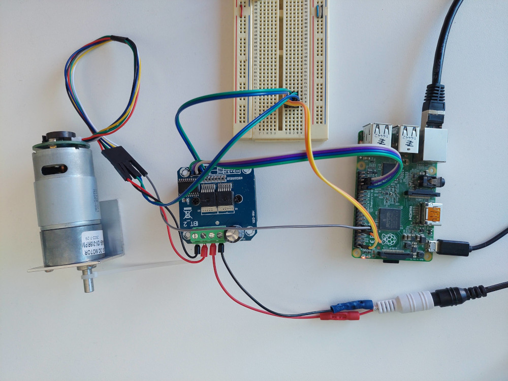

# BTS7960 Python package
Python library to control the BTS7960 Dual H-Bridge using the rapsberry pi.

## setup
```
sudo apt install rpi.gpio-common python3-pigpio python3-gpiozero python3-rpi.gpio.
pip install readchar RPi.GPIO
```

## Usage
### Import 
```
from bts7960 import rpi_JGB37545 
mt = rpi_JGB37545.motor(hall_sensor=17, 
           bts_L_EN=13, 
           bts_R_EN=19, 
           bts_L_PWM=6, 
           bts_R_PWM=12, 
           wheel_diameter = 0.1)
```

### Interactive script

interactive_motor_cmd.py.py is configured for the following setup:
> **_FUTURE:_** Will add a connection diagram



To run the iteractive command script:
```
cd [bts7960 repo location]
python -m scripts.interactive_motor_cmd.py
```
Should get an output like this:
```
========== Status ==========
Current power:   0.2
RPM:   62
Speed:   0.3289022526669135
========== Menu ==========
a: Increment Power
s: Decrement Power
g: Update Status
x: Stop Motor
q: Quit
```
#### Keys
- 'a' or 's' to change the commanded value.
- 'g' to update the status table
- 'x' to send 0 power and disable the PWM output
- 'q' to exit the script